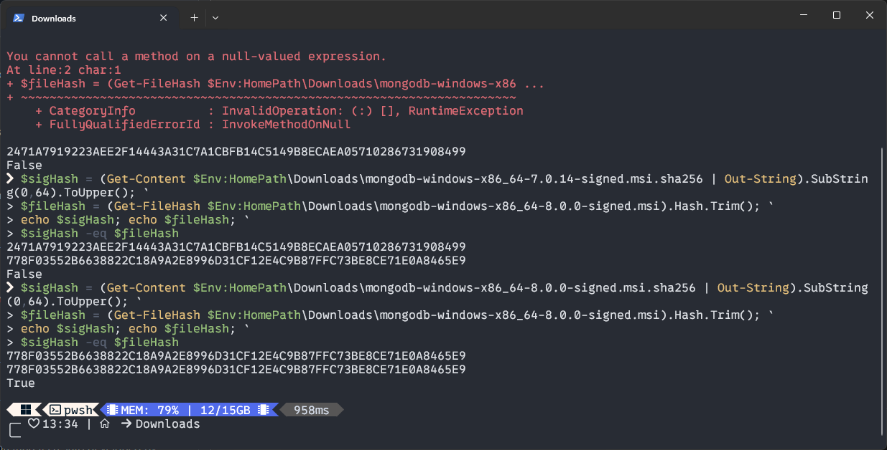
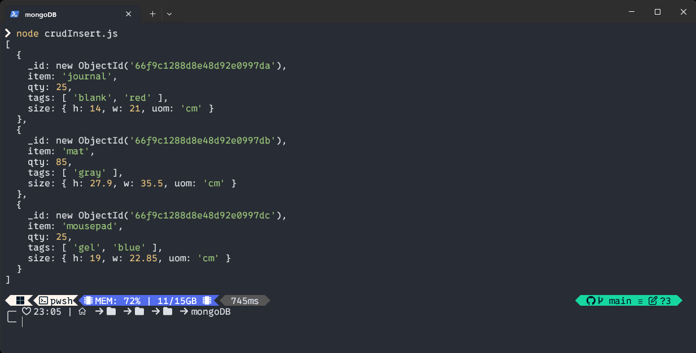
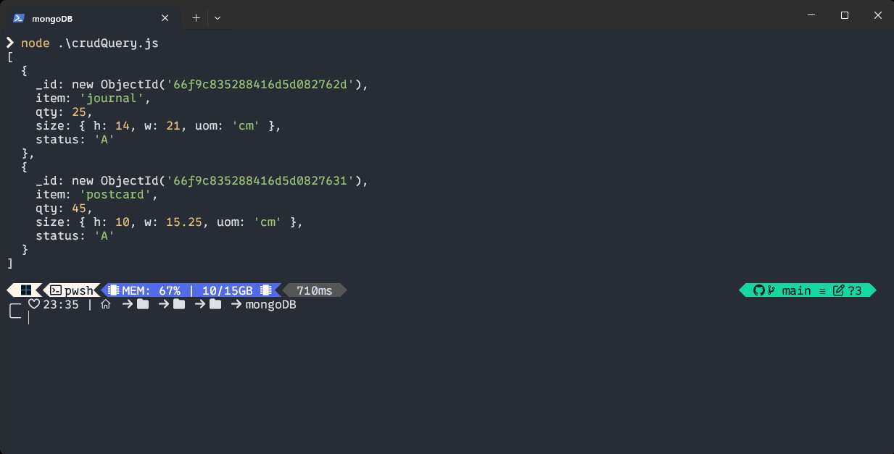
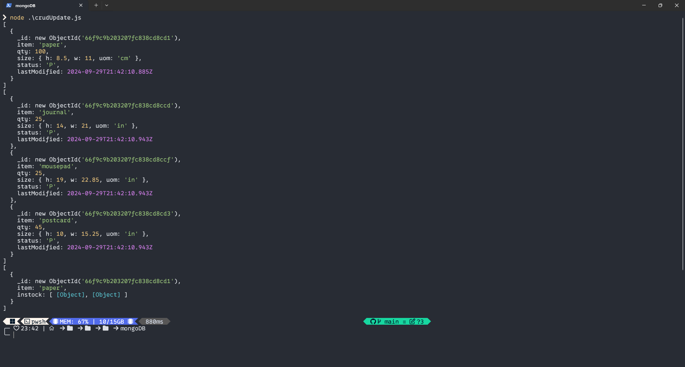
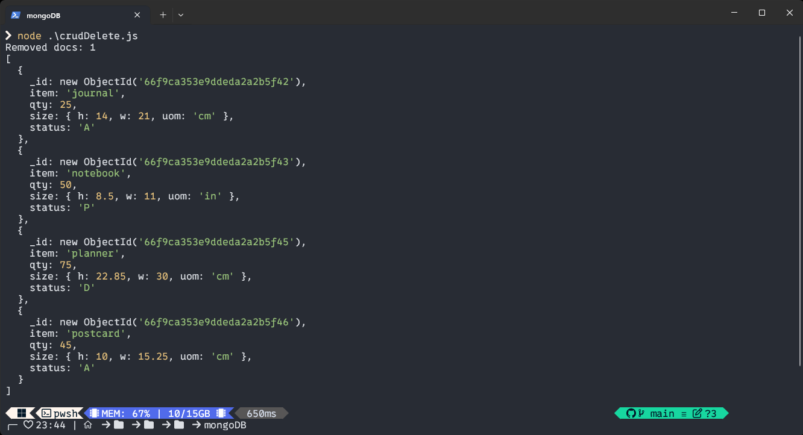
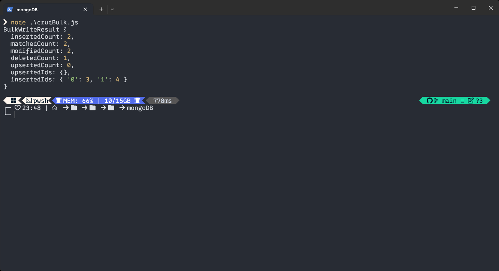
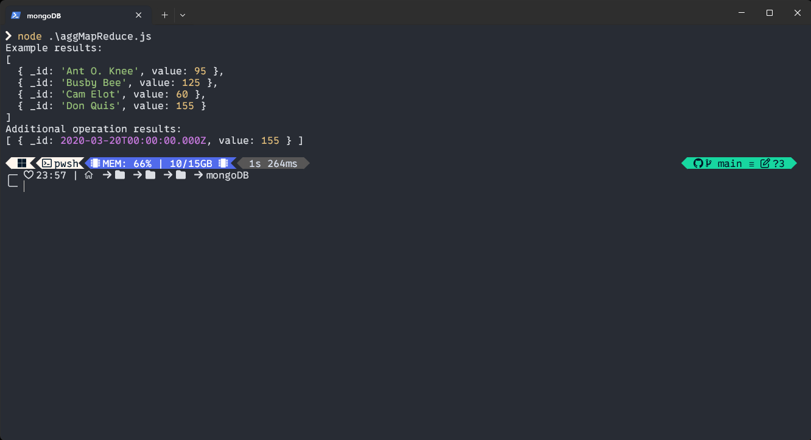
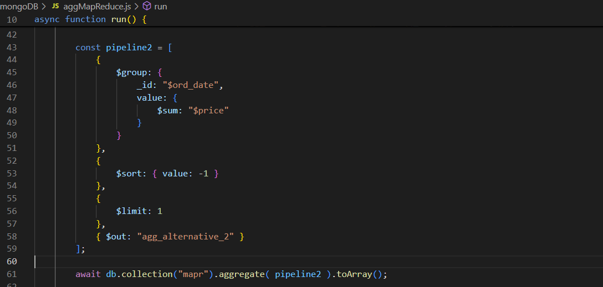

# Expass 5

## Technical problems
I struggled with getting mongosh to work, and instead decided to work in node.js. From what I could gather from the documentation the map-reduce function in node is deprecated, which meant that I had to convert to the format for node aggregation.

## Screenshots
Verification of installed package 

CRUD Insert multiple documents

CRUD Query both AND and OR conditions

CRUD Update after all three operations

CRUD Remove only one that matches condition

CRUD Bulk Write

Map Reduce working example and additional operation

Additional operation code

My operation maps the days and the value of the transactions, and sums the total value for each day. It then returns the day with the highest spending (though by just removing the limit parameter it will return a descending list of days sorted by money spent). This I think could be useful for determining which days get the most traffic, which could be used for some other purpose.

## Pending issues
I dont think there are any pending issues other than getting mongosh to work properly.